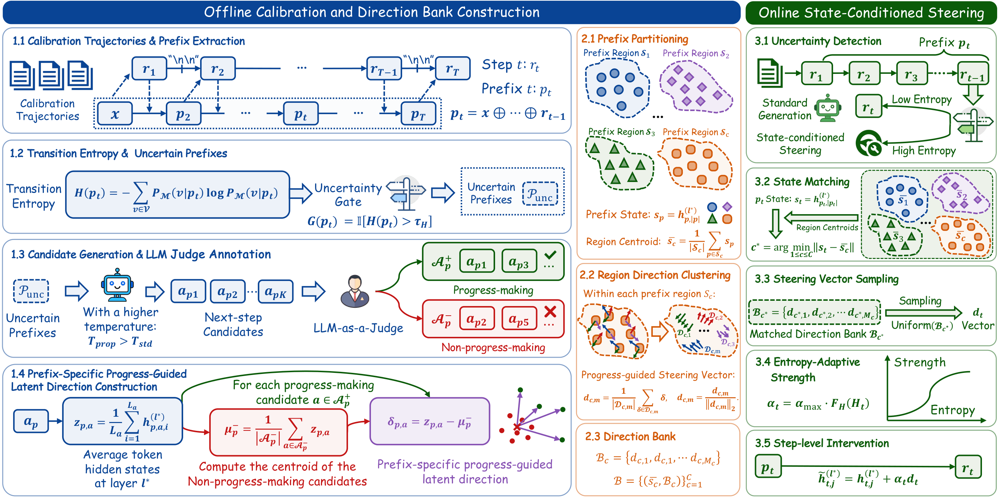

# 🧭 SPS: State-conditioned Progress-guided Steering

This is the official implementation of **SPS**, a training-free latent steering framework for improving reasoning exploration under limited rollout budgets.

SPS first builds a **state-conditioned Direction Bank** from a small calibration set. During inference, it intervenes only at high-uncertainty reasoning transitions, matches the current reasoning prefix to a state region, samples a progress-guided steering vector from the corresponding Direction Bank, and applies entropy-adaptive steering while generating the next reasoning step.

<p align="center">
  
</p>


---

## ⚙️ Setup

We recommend Python 3.10+ and a CUDA environment compatible with the installed PyTorch version.

1. **Create the environment and install dependencies**

   ```bash
   bash scripts/setup.sh
   source .venv/bin/activate
   ```

2. **Set the OpenAI API key for candidate annotation**


   ```bash
   export OPENAI_API_KEY=YOUR_KEY
   ```

3. **Check the default SPS configuration**

   The main hyperparameters are defined in `configs/sps.yaml`.

   ```yaml
   generation:
     temperature: 0.6
     top_p: 0.95
     top_k: 20
     max_new_tokens: 32768

   candidate:
     temperature: 1.2
     num_candidates: 32

   uncertainty:
     entropy_quantile: 0.8

   judge:
     model: gpt-5.5
     reasoning_effort: medium
   ```

The repository currently supports:

```text
qwen3_1.7b
qwen3_4b
qwen3_8b
qwen3_14b
```

---

## 📦 Data Preparation

### Calibration data

The offline SPS pipeline uses **DAPO-Math-17K** as the calibration source. The preparation script downloads the dataset automatically and randomly samples 200 prompts according to the default configuration.

```bash
python offline/prepare_calibration.py \
    --config configs/sps.yaml \
    --model qwen3_4b
```

The sampled prompts and generated calibration trajectories are saved under:

```text
outputs/qwen3_4b/
```

### Evaluation data
```text
data/
├── math500.jsonl
├── Minerva-Math-272.jsonl
├── olym.jsonl
├── aime24.jsonl
├── aime25.jsonl
├── hmmt25.jsonl
├── gpqa_diamond.jsonl
├── livecodebench_release_v5_2024_08_01.jsonl
└── strategyqa.jsonl
```

A mathematical benchmark record follows the format:

```json
{"data_source": "AIME25", "question": "Find ...", "ref_answer": "70"}
```

Cross-domain records may contain additional fields such as `starter_code`, answer choices, executable tests, or supplied facts. Benchmark-specific generation prompts are implemented in `sps/prompts.py`, with the exact prompt templates collected in `prompts/templates.md`.

---

## 🏗️ Offline Direction Bank Construction

The offline stage consists of three main parts: calibration and uncertainty extraction, candidate generation and annotation, and Direction Bank construction.

### 🔹 Calibration Rollouts and Uncertain Prefixes

Run:

```bash
python offline/prepare_calibration.py \
    --config configs/sps.yaml \
    --model qwen3_4b
```

For each sampled calibration prompt, SPS generates a reasoning trajectory in thinking mode and splits it into reasoning steps using `\n\n`. At every reasoning-step boundary, the script computes next-token entropy for the first token of the next step. The 80th percentile of the calibration entropy distribution is used as the **Uncertainty Gate**, and prefixes above this threshold are retained for candidate generation.

Outputs:

```text
outputs/qwen3_4b/calibration_prompts.jsonl
outputs/qwen3_4b/calibration_rollouts.jsonl
outputs/qwen3_4b/prefix_steps.jsonl
outputs/qwen3_4b/uncertain_prefixes.jsonl
outputs/qwen3_4b/boundary_entropies.npy
outputs/qwen3_4b/uncertainty_gate.json
```

### 🔹 Candidate Generation and Annotation

For each uncertain prefix, SPS samples 32 candidate next steps with proposal temperature 1.2.

Run candidate generation and LLM-as-Judge annotation:

```bash
python offline/generate_and_annotate.py \
    --config configs/sps.yaml \
    --model qwen3_4b
```

Outputs:

```text
outputs/qwen3_4b/candidate_steps_deduplicated.jsonl
outputs/qwen3_4b/candidate_annotations.jsonl
outputs/qwen3_4b/annotation_summary.json
```

### 🔹 Prefix-specific Directions and Direction Bank

Run:

```bash
python offline/construct_bank.py \
    --config configs/sps.yaml \
    --model qwen3_4b
```

SPS then:

1. clusters prefix states into **state regions**;
2. clusters the associated progress-guided directions within each region;
3. recomputes state centroids and direction centroids in the original hidden-state space;
4. L2-normalizes the direction centroids to obtain the final steering vectors.

PCA is used for clustering assignments. The selected intervention layers are:

```text
Qwen3-1.7B: Layer 20 / 28
Qwen3-4B:   Layer 22 / 36
Qwen3-8B:   Layer 25 / 36
Qwen3-14B:  Layer 32 / 40
```

The region-wise direction-cluster counts are:

```text
Qwen3-1.7B: [6, 6, 4, 6, 4, 8, 6, 8, 4, 6]
Qwen3-4B:   [6, 8, 6, 4, 6, 6, 8, 6]
Qwen3-8B:   [6, 4, 6, 6, 4, 8, 6, 6]
Qwen3-14B:  [6, 6, 4, 6, 8, 4, 6, 6, 4, 8]
```

Outputs:

```text
outputs/qwen3_4b/prefix_directions.npz
outputs/qwen3_4b/state_pca.joblib
outputs/qwen3_4b/state_kmeans.joblib
outputs/qwen3_4b/direction_pca_region_*.joblib
outputs/qwen3_4b/direction_kmeans_region_*.joblib
outputs/qwen3_4b/direction_bank.npz
outputs/qwen3_4b/direction_bank_summary.json
```

To run the complete offline pipeline:

```bash
bash scripts/run_offline.sh qwen3_4b configs/sps.yaml
```

---

## 🧭 Online State-conditioned Steering

Once the Direction Bank is constructed, SPS can be directly applied during generation without any additional model training.

For a single benchmark:

```bash
bash scripts/run_online.sh \
    qwen3_4b \
    data/aime24.jsonl \
    4 \
    configs/sps.yaml
```

At each reasoning-step boundary, SPS computes the transition entropy and checks the offline-calibrated Uncertainty Gate.


---

## 📈 Evaluation

### 🧮 Mathematical Reasoning

The six mathematical benchmarks use the default step-by-step generation prompt and extract the final answer from `\boxed{}`.

Run SPS on all nine benchmarks with four rollouts per problem:

```bash
bash scripts/evaluate_all.sh \
    qwen3_4b \
    configs/sps.yaml \
    4
```


### 🌐 Cross-domain Evaluation

The repository also supports:

```text
GPQA-Diamond
StrategyQA
LiveCodeBench
```

GPQA-Diamond and StrategyQA use benchmark-specific JSON answer formats. LiveCodeBench extracts the generated Python program and evaluates it against the available test cases.

To build the Direction Bank and evaluate all benchmarks end-to-end:

```bash
bash scripts/run_all.sh \
    qwen3_4b \
    configs/sps.yaml \
    4
```

---

## 🔬 Additional Analysis

### Automatic Intervention Layer Selection

SPS selects the intervention layer using the linear separability between progress-making and non-progress-making candidate-step representations.

Run:

```bash
bash scripts/run_probe.sh qwen3_4b
```

The probing pipeline samples 2,000 balanced positive/negative candidate steps, uses an 80/20 stratified train/test split, averages token hidden states at normalized layer depths from 10% to 100%, applies PCA with retained variance above 90%, and fits a ridge-regression linear probe. The layer with the highest held-out ROC AUC is selected for steering.

Outputs:

```text
outputs/qwen3_4b/probe_auc.csv
outputs/qwen3_4b/probe_auc.json
```


---

## 📝 Prompt Templates

All prompts used in the experiments are provided in:

```text
prompts/templates.md
sps/prompts.py
```

They include:

- the default generation prompt for the six mathematical benchmarks;
- GPQA-Diamond, StrategyQA, and LiveCodeBench evaluation prompts;
- the complete LLM-as-Judge candidate annotation prompt.

---

## 📁 Repository Structure

```text
SPS_GitHub_Repo_v3/
├── configs/                 # SPS configuration
├── prompts/                 # Prompt templates
├── assets/                  # Framework figure
├── data/                    # Evaluation data and auxiliary files
├── sps/                     # Core SPS implementation
├── offline/                 # Direction Bank construction
├── online/                  # SPS inference and evaluation
├── analysis/                # Probing and annotation analysis
├── scripts/                 # Reproduction scripts
├── outputs/                 # Generated artifacts and predictions
├── requirements.txt
├── pyproject.toml
└── README.md
```

---

## 🧡 Acknowledgments

We thank the authors and maintainers of **Qwen3**, **vLLM**, **DAPO-Math-17K**, and the evaluation benchmarks used in this work for making their models, datasets, and tools publicly available.
